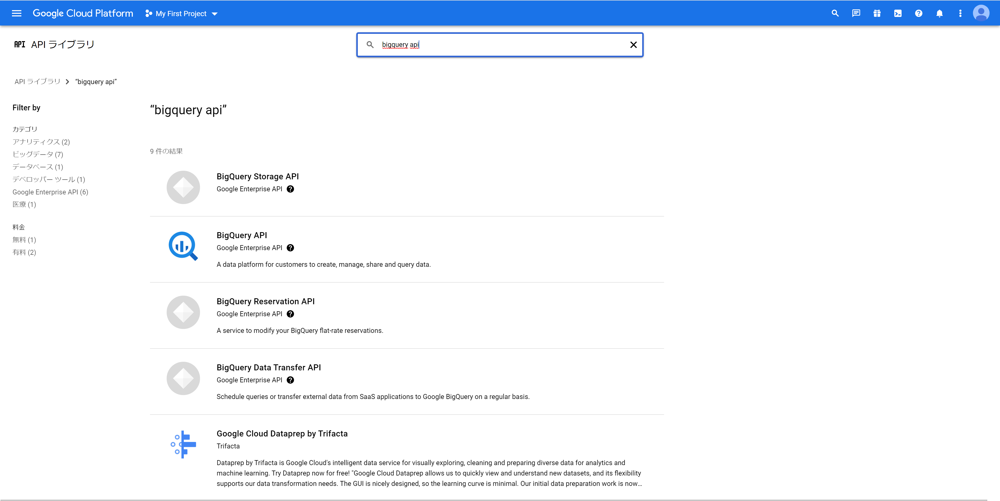
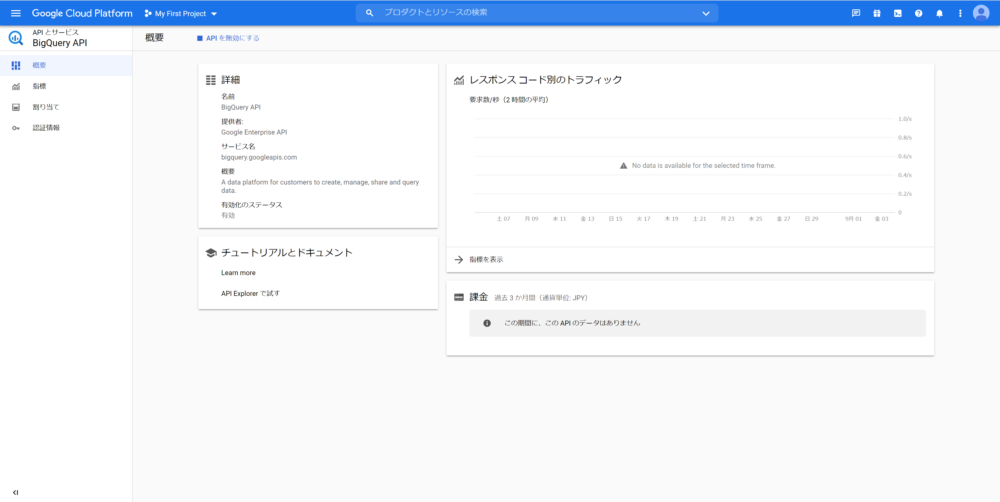
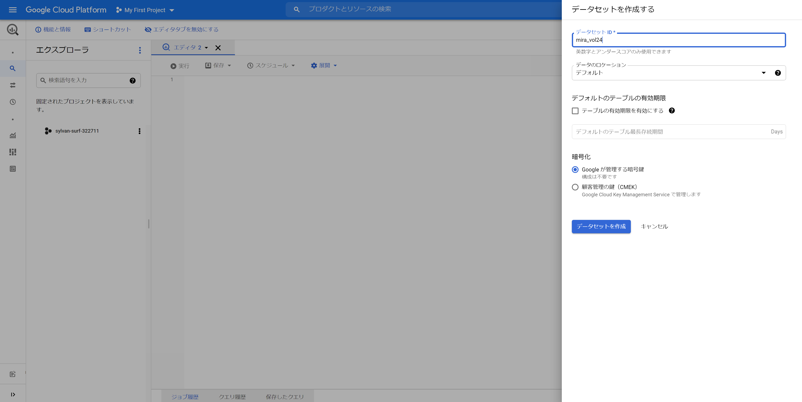
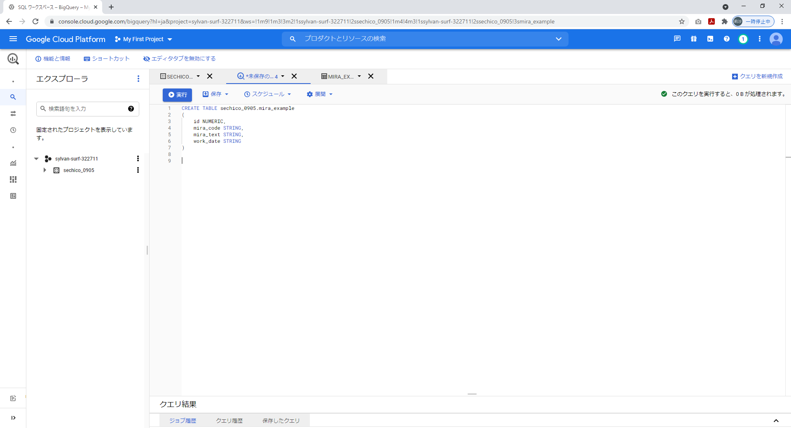

# GCP各種サービスの設定
この手順では次の手順を進めていきます。  


## GCSバケット作成
グローバルに一意になるように各自設定を行います。  


↓作成完了  


## GCS内権限設定
GCSの権限を「ストレージ管理者」に設定します。  


## サービスアカウントの作成


↓作成完了  


## 秘密鍵ファイルの取得・配置


※json形式のキーをダウンロード  

ダウンロードした秘密鍵ファイルを、配置する。  
・配置先  
```
mirameet_vol24\credential
```
・ファイル名  
```
key.json
```
## BigQueryAPIの有効化


↓完了  


## データセットの作成

↓完了  


## テーブルの作成

\mirameet_vol24\sql\mira_vol24.sql  
をご自身の作成したデータセットIDに置換してクエリ実行  
（例）  
```
CREATE TABLE mira_vol24.mira_example　～～～
↓
CREATE TABLE sechico_0905.mira_example　～～～
```
↓実行完了  


## OperationObject.pyの編集
### url_gs_example_csv  

「gsutil URI」をコピーして置換  
（例）  
```
url_gs_example_csv="gs://mira-example/gcs-example.csv"
↓
url_gs_example_csv="gs://sechico-mirameet_vol24/gcs-example.csv"
```
### bucket_name

「名前」をコピーして置換  
（例）  
```
bucket_name = "mira-example"
↓
bucket_name = "sechico-mirameet_vol24"
```
### project_id

```
「プロジェクトID」をコピーして置換  
（例）  
project_id = "erudite-pride-323410"
↓
project_id = "sylvan-surf-322711"
```
### dataset_id

「データセットID」をコピーして置換  
（例）  
```
dataset_id = "mira_vol24"
↓
dataset_id = "sechico_0905"
```
### table_id　←テーブル作成時のクエリから変えている場合  

「テーブルID」をコピーして置換  
（例）  
```
table_id = "mira-example"
↓
table_id = "mira-example"　←テーブル作成時のクエリ
```
