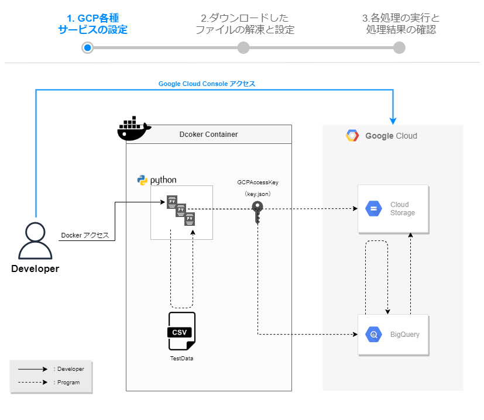

# GCP各種サービスの設定  
この手順では、GCPサービスの設定を進めていきます。  
  


## GCSバケット作成  
左上のナビゲーションメニューから、CloudStorageを選択  

「バケットを作成」をクリック

グローバルに一意になるように各自設定を行います。  

↓作成完了  


## サービスアカウントの作成  
左上のナビゲーションメニューから、IAMと管理＞サービスアカウントを選択  

任意のサービスアカウント名を入力  


↓作成完了  


## 秘密鍵ファイルの作成・ダウンロード  
作成したサービスアカウントを選択  

「キー」タブ＞「新しい鍵を作成」を選択  

json形式のキーをダウンロード  

↓ダウンロード完了  


## CloudStorageAPIが有効化されていることを確認  
画面上部の検索窓に「Cloud Storage」と入力し、検索結果から「Cloud Storage API」を選択  

※「APIが有効です」となっていることを確認  


## BigQueryAPIが有効化されていることを確認  
画面上部の検索窓に「BigQuery API」と入力し、検索結果から「BigQuery API」を選択  

※「APIが有効です」となっていることを確認  


## データセットの作成  
左上のナビゲーションメニューから、BigQueryを選択  

エクスプローラーの中の「▶プロジェクト名」から「データセットを作成」を選択  

画面右側に「データセットを作成する」が出てくるので、「データセットID」を入力  
※今回は「mira_vol24」を指定  

↓完了  
「▶プロジェクト名」の下に「▶mira_vol24」が作成される  


## テーブルの作成  
作成したデータセット「mira_vol24」に対して、クエリを実行し、テーブルを作成  
※今回は「mira_example」を指定 

```
CREATE TABLE mira_vol24.mira_example
(
	id NUMERIC,
	mira_code STRING,
	mira_text STRING,
	work_date STRING
)
```
※データセットIDを「mira_vol24」から変更した場合は、  
　ご自身が指定したデータセットIDに置換して実行する必要があります  
※先ほどDLしたソースファイルの\sql\mira_vol24.sql  の中にも同じSQLがあります  
↓実行完了  

先ほど実行したクエリ通りのフィールドが表示されていることを確認  


このクエリは、  
```
データセットID＝mira_vol24
テーブルID＝mira_example
```
を指定しています  
