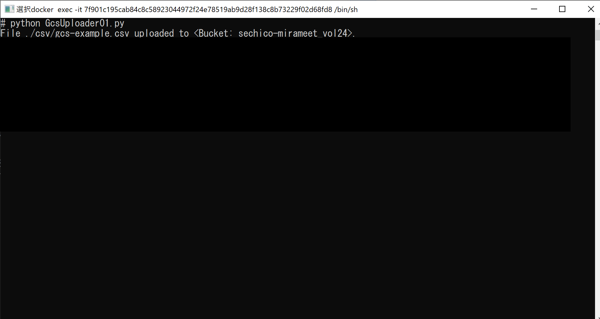

# 各処理の実行と処理結果の確認

## カレントディレクトリの移動
```
cd ～～～\mirameet_vol24
```

## GcsUploader01.pyの実行
```
python GcsUploader01.py
```
  
CSVファイルがGCSにアップロードされていることを確認。
  

## GcsToBigQuery02.pyの実行
```
python GcsToBigQuery02.py
```
  
CSVの中のデータがBigQueryにインサートされていることを確認。
  

## UpdateDeleteBigQuery03.pyの実行
```
python UpdateDeleteBigQuery03.py
```
  
データが更新・削除されていることを確認。
  

## ExportBigQuery04.pyの実行
```
python ExportBigQuery04.py
```
  
BigQueryのデータが「out-gcs-example.csv」ファイルとしてGCSに出力されていることを確認。
  