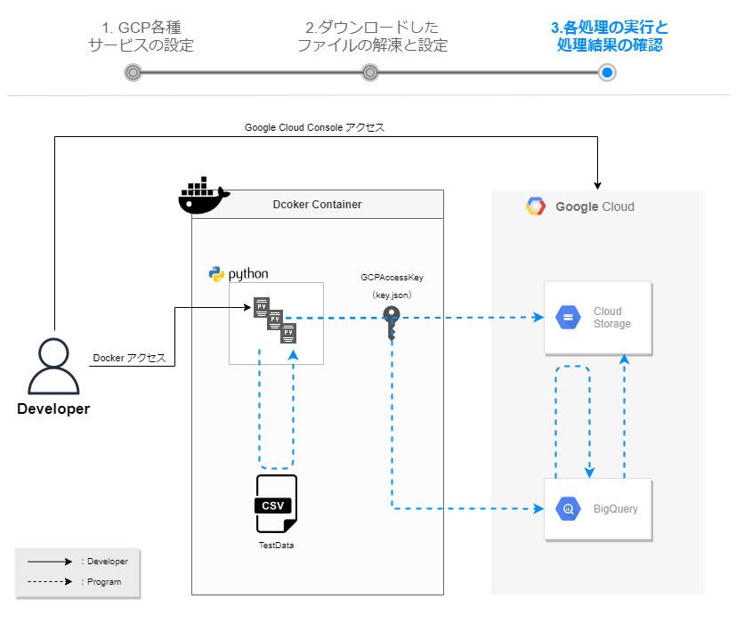

# 各処理の実行と処理結果の確認  
この手順では、手順２で修正したOperationObject.pyを含む各ソースを動かし、BigQueryのデータを操作していきます。
  


## カレントディレクトリの移動  
Zipファイルを解凍したディレクトリまで移動  
```
cd ～～～mirameetVol24-main
```

## Dockerでコンテナを起動  
```
docker-compose up -d --build
```
  


## 起動したDockerコンテナに接続  
```  
docker-compose exec app bash
```  


## GcsUploader01.pyの実行 
  
CSVデータファイルをGCSバケット上にアップロードする  
```
python GcsUploader01.py
```
▼中身
```
import os
import OperationObject # 操作対象の設定情報取得
from google.cloud import storage

# GCP認証設定
os.environ['GOOGLE_APPLICATION_CREDENTIALS'] = OperationObject.GOOGLE_APPLICATION_CREDENTIALS

# GCSクライアントAPIの利用宣言
client = storage.Client()

# GCSバケット取得
bucket = client.get_bucket(OperationObject.bucket_name)

# CSVファイルアップロード
blob = bucket.blob(os.path.basename(OperationObject.source_file_name))
blob.upload_from_filename(OperationObject.source_file_name)

print('File {} uploaded to {}.'.format(
    OperationObject.source_file_name,
    bucket))
```
↓正常終了  
  
mirameetVol24-main\src\csvの中の「gcs-example.csv」が、GCSにアップロードされていることを確認  
  

## GcsToBigQuery02.pyの実行  
  
GCSにアップロードしたCSVデータをBigQueryにインサートする  
```
python GcsToBigQuery02.py
```
▼中身
```
import os
import OperationObject # 操作対象の設定情報取得
from google.cloud import bigquery

# GCP認証設定
os.environ['GOOGLE_APPLICATION_CREDENTIALS'] = OperationObject.GOOGLE_APPLICATION_CREDENTIALS

# BigQueryクライアントAPIを利用宣言
client = bigquery.Client(OperationObject.project_id)

# テーブル情報の取得
table_info = client.dataset(OperationObject.dataset_id).table(OperationObject.table_id)

# 登録対象のテーブル定義を設定
job_config = bigquery.LoadJobConfig(
    # テーブルカラムマッピング情報の設定
    schema=[
        bigquery.SchemaField("id", "NUMERIC"),
        bigquery.SchemaField("mira_code", "STRING"),
        bigquery.SchemaField("mira_text", "STRING"),
        bigquery.SchemaField("work_date", "STRING")
    ],
    # 読み込み開始行の指定（ヘッダ行がないため0を設定）
    skip_leading_rows=0,
    # ソースフォーマットの指定（CSV形式に設定）
    source_format=bigquery.SourceFormat.CSV,
)

# GCSバケットをロードし、テーブルに登録
load_job = client.load_table_from_uri(
    OperationObject.url_gs_example_csv, table_info, job_config=job_config
)

load_job.result()  # load_table_from_uriが終了するまで待機

regist_table_info = client.get_table(table_info)  # 登録後のテーブル情報取得
print("Loaded {} rows.".format(regist_table_info.num_rows))
```
↓正常終了  
  
「gcs-example.csv」の中のデータがBigQueryにインサートされていることを確認  
プレビュータグでデータの中身を確認  
  

## UpdateDeleteBigQuery03.pyの実行  
  
BigQueryのデータを更新・削除する  
```
python UpdateDeleteBigQuery03.py
```
▼中身
```
import os
import OperationObject # 操作対象の設定情報取得
from google.cloud import bigquery

# GCP認証設定
os.environ['GOOGLE_APPLICATION_CREDENTIALS'] = OperationObject.GOOGLE_APPLICATION_CREDENTIALS

# BigQueryクライアントAPIの利用宣言
client = bigquery.Client()

# 更新SQL生成
updateQuery = "UPDATE `{0}.{1}.{2}` SET mira_text = '更新' WHERE id = 2".\
    format(OperationObject.project_id, OperationObject.dataset_id, OperationObject.table_id)
# SQL実行
client.query(updateQuery).result()
print("Updated ID=2.")

# 削除SQL生成
deleteQuery = "DELETE `{0}.{1}.{2}` WHERE id = 3".\
    format(OperationObject.project_id, OperationObject.dataset_id, OperationObject.table_id)
# SQL実行
client.query(deleteQuery).result()
print("Deleted ID=3.")
```
↓正常終了  
  
ID＝2のデータが更新、ID＝3のデータが削除されていることを確認  
  

## ExportBigQuery04.pyの実行  
  
BigQueryのデータをCSVデータファイルとしてGCSバケットにエクスポートする  
```
python ExportBigQuery04.py
```
▼中身
```
import os
import OperationObject # 操作対象の設定情報取得
from google.cloud import bigquery

# GCP認証設定
os.environ['GOOGLE_APPLICATION_CREDENTIALS'] = OperationObject.GOOGLE_APPLICATION_CREDENTIALS

# BigQueryクライアントAPIの利用宣言
client = bigquery.Client(OperationObject.project_id)
# テーブル情報の取得
table_info = client.dataset(OperationObject.dataset_id).table(OperationObject.table_id)

# データ取得結果をGCSバケットにエキスポート 
extract_job = client.extract_table(
    table_info,
    OperationObject.out_url_gs_example_csv,
)

extract_job.result() # extract_tableが終了するまで待機

print(
    "Exported {}:{}.{} to {}".format(
        OperationObject.project_id,
        OperationObject.dataset_id,
        OperationObject.table_id,
        OperationObject.out_url_gs_example_csv)
)
```
↓正常終了  
  
BigQueryのデータが「out-gcs-example.csv」ファイルとしてGCSに出力されていることを確認  
  
ダウンロードボタンでファイルをローカルにダウンロード  
  
ダウンロードしたCSVファイルの中身で更新後の状態を確認  
  

