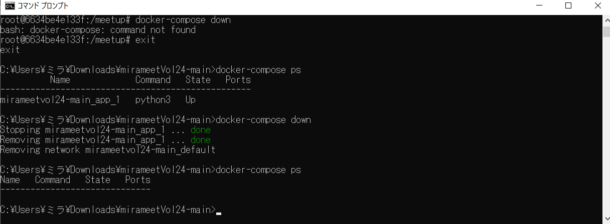

# おまけ
この手順では、作成したテーブルやバケットの削除をします  

※無料期間が終了しても自動で課金されることはありません  
　GCP内をCleanUpしたい方は以下手順を行ってください  

## バケットの削除  
  

  


## データセットの削除  
  

  


## Dockerコンテナの停止  
起動中のコンテナの確認  
```
docker-compose ps
```
コンテナの停止  
```
docker-compose down
```
コンテナが停止されたことの確認  
```
docker-compose ps
```
  
